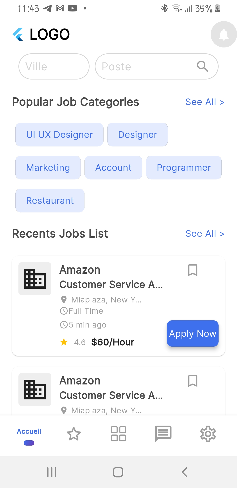
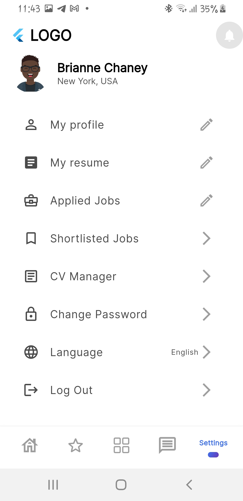
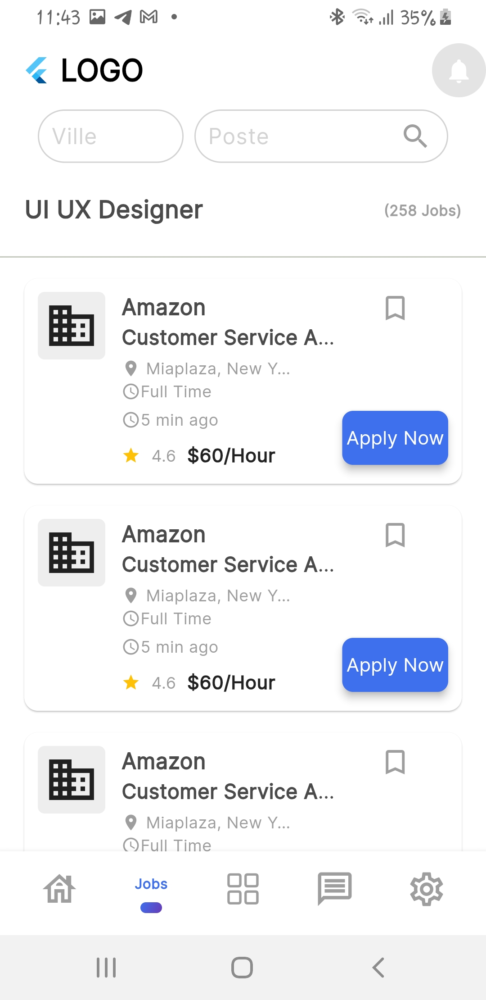
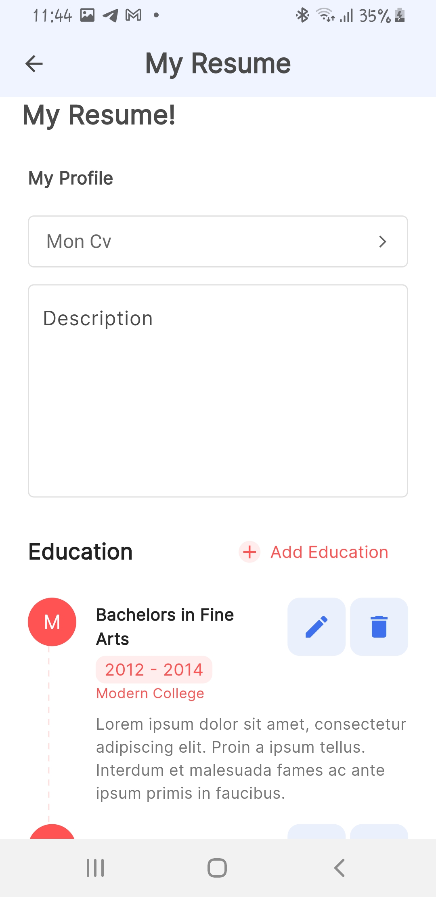
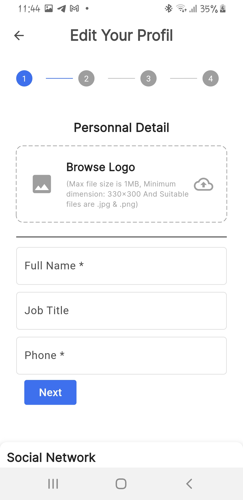

# jobs_app

Cette application flutter est une application mobile pour trouver de l'emploie en ligne et aussi de permettre au employeur de proposer des offres d'emploie 

## Getting Started

This project is a starting point for a Flutter application.

A few resources to get you started if this is your first Flutter project:

- [Lab: Write your first Flutter app](https://docs.flutter.dev/get-started/codelab)
- [Cookbook: Useful Flutter samples](https://docs.flutter.dev/cookbook)

For help getting started with Flutter development, view the
[online documentation](https://docs.flutter.dev/), which offers tutorials,
samples, guidance on mobile development, and a full API reference.
## Features

- User authentication
- Job search and filtering
- Job application tracking
- Notifications for new job postings
- User profile management
- ...

## Installation

1. Clone the repository:
    ```sh
    git clone https://github.com/hnk229/jobs_app.git
    ```
2. Navigate to the project directory:
    ```sh
    cd jobs_app
    ```
3. Install dependencies:
    ```sh
    flutter pub get
    ```
4. Run the application:
    ```sh
    flutter run
    ```

## Contributing

Contributions are welcome! Please follow these steps:

1. Fork the repository.
2. Create a new branch:
    ```sh
    git checkout -b feature/your-feature-name
    ```
3. Make your changes and commit them:
    ```sh
    git commit -m 'Add some feature'
    ```
4. Push to the branch:
    ```sh
    git push origin feature/your-feature-name
    ```
5. Open a pull request.

## License

This project is licensed under the MIT License - see the [LICENSE](https://github.com/hnk229) file for details.
## Screenshots

Here are some screenshots of the application:

### Homepage


### Settings


### Find Jobs


### My Resume


### Edit Your Profile
